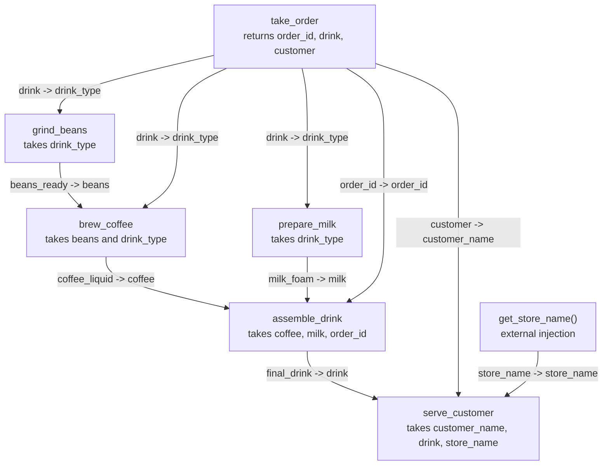
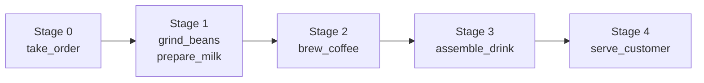

# Coffee Shop Example

This page explains `examples/coffee_shop.py`, a small workflow that models a coffee shop order. The example splits the process into Astrum tasks and uses `TaskData` / `DataItem` / `DTRela` to describe how data moves between tasks.

## DAG overview

There are two kinds of relationships:

- Task dependencies decide when each task may run.
- Data mappings decide which upstream values become downstream function arguments.

`get_store_name` is not a Astrum task. It is a regular function injected through `from_function`, so it contributes data to `serve_customer` without becoming a DAG node.

## Execution stages

`grind_beans` and `prepare_milk` only depend on `take_order.drink`, so they can start in parallel. `brew_coffee` waits for beans and drink type, `assemble_drink` gathers the brewed coffee, milk foam, and order id, and `serve_customer` performs the final delivery.

## Task notes

| Task | Role | Important data |
| --- | --- | --- |
| `take_order` | Entry task | Emits `order_id`, `drink`, and `customer`. |
| `grind_beans` | Preparation branch | Reads `take_order.drink`, emits `beans_ready`. |
| `brew_coffee` | Processing branch | Reads beans and drink type, emits `coffee_liquid`. |
| `prepare_milk` | Parallel preparation branch | Reads drink type, emits `milk_foam`. |
| `assemble_drink` | Fan-in node | Combines coffee, milk, and order id. |
| `serve_customer` | Final node | Reads customer, drink, and externally injected store name. |

## Data flow matrix

| Downstream task | Parameter | Source |
| --- | --- | --- |
| `grind_beans` | `drink_type` | `take_order.drink` |
| `brew_coffee` | `beans` | `grind_beans.beans_ready` |
| `brew_coffee` | `drink_type` | `take_order.drink` |
| `prepare_milk` | `drink_type` | `take_order.drink` |
| `assemble_drink` | `coffee` | `brew_coffee.coffee_liquid` |
| `assemble_drink` | `milk` | `prepare_milk.milk_foam` |
| `assemble_drink` | `order_id` | `take_order.order_id` |
| `serve_customer` | `customer_name` | `take_order.customer` |
| `serve_customer` | `drink` | `assemble_drink.final_drink` |
| `serve_customer` | `store_name` | `get_store_name()` |

## How to read this example

Start by finding each `@task(task_id=...)`, then inspect its `TaskData.input_data_item`. Finally, connect every `from_relation` to its matching `to_relation`. This is usually easier than reading the source top-to-bottom, because Astrum runs by dependency graph, not by file order.

