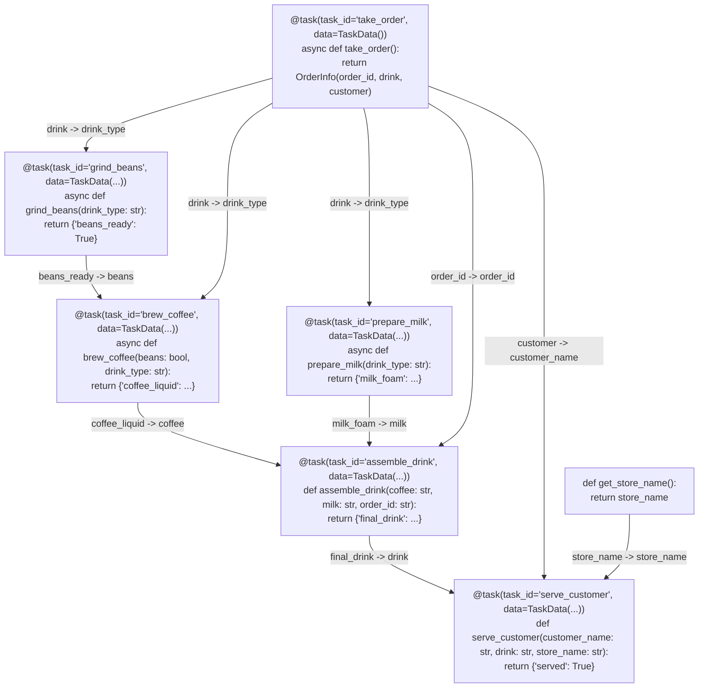
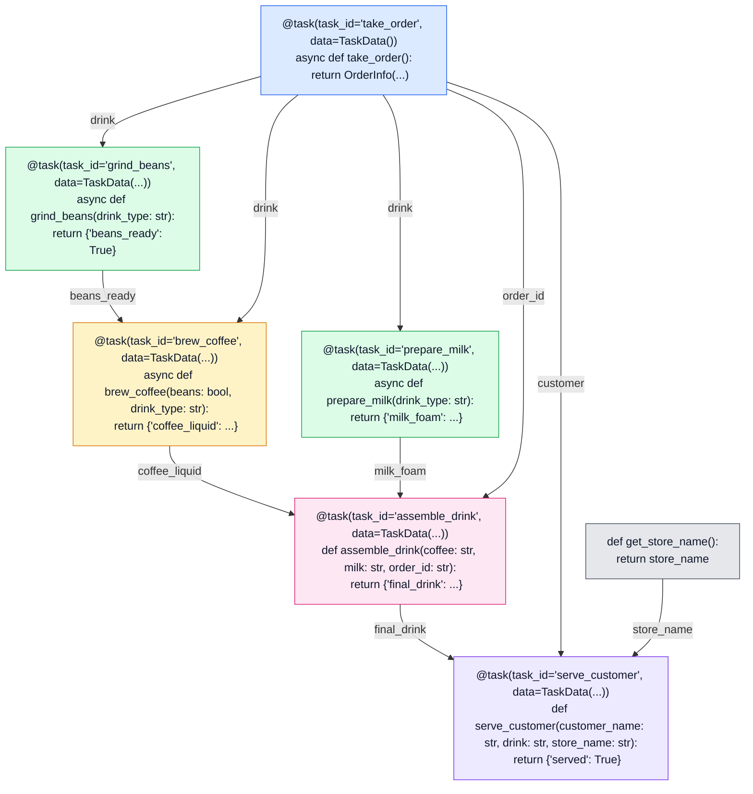
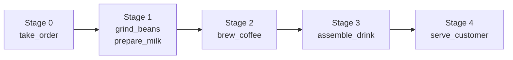
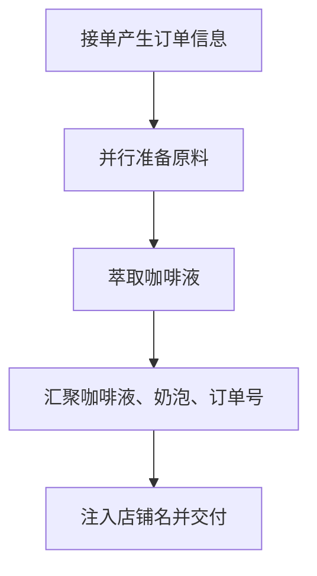

# Coffee Shop 示例图解

本文用 Mermaid 图解释 `examples/coffee_shop.py` 中的咖啡店工作流。这个示例把“接单、磨豆、萃取、打奶泡、组合、交付”拆成 6 个 Astrum task，并通过 `TaskData` / `DataItem` / `DTRela` 描述任务之间的数据流。

直接阅读源码时，任务声明、数据关系和执行顺序交错在一起；下面的图把每个 task 放进自己的框里，框内直接展示关键源码片段，包括 `@task(...)` 装饰器。Mermaid 节点本身不支持 Python 语法高亮，所以每个任务小节还保留了带高亮的 `python` 代码块。

## DAG 总览



这张图里有两类关系：

- 任务依赖：下游 task 必须等待上游 task 产出数据。
- 数据映射：边标签左侧是上游输出字段，右侧是下游函数参数名。

`get_store_name` 不是 Astrum task，而是通过 `from_function=get_store_name` 注入到 `serve_customer` 的普通函数，因此它不会成为 DAG 任务节点，但它也是 `serve_customer` 的一个输入来源。

## 彩色分类版

下面这张图使用 Mermaid 的 `classDef` 手动高亮不同角色。它不是 Python 语法级高亮，而是按 DAG 语义给节点分类：入口、并行准备、加工、汇聚、终点和外部注入。



## 执行阶段



`grind_beans` 和 `prepare_milk` 都只依赖 `take_order` 的 `drink` 字段，因此可以在接单完成后并行启动。`brew_coffee` 需要同时等待 `grind_beans.beans_ready` 和 `take_order.drink`；`assemble_drink` 再汇聚浓缩液、奶泡和订单号；最后由 `serve_customer` 完成交付。

## 逐任务说明

### 1. `take_order`

```python
@task(task_id="take_order", data=TaskData())
async def take_order():
    return OrderInfo(order_id="ORDER-2026", drink="焦糖玛奇朵", customer="Alice")
```

`take_order` 是整个 DAG 的入口任务，没有上游依赖。它输出一个 `OrderInfo`，后续任务会分别读取其中的 `drink`、`order_id` 和 `customer` 字段。

输出去向：

- `drink` -> `grind_beans.drink_type`
- `drink` -> `brew_coffee.drink_type`
- `drink` -> `prepare_milk.drink_type`
- `order_id` -> `assemble_drink.order_id`
- `customer` -> `serve_customer.customer_name`

### 2. `grind_beans`

```python
@task(task_id="grind_beans", data=TaskData(...))
async def grind_beans(drink_type: str):
    res: dict = {"beans_ready": True}
    return res
```

`grind_beans` 从 `take_order` 获取 `drink` 字段，并把它注入为自己的 `drink_type` 参数。它完成磨豆后返回 `beans_ready`，供 `brew_coffee` 使用。

数据映射：

```python
DataItem(
    allow_data_model=OrderInfo,
    from_relation=DTRela(key="drink", related_task="take_order"),
    to_relation=DTRela(key="drink_type", related_task="grind_beans"),
)
```

### 3. `brew_coffee`

```python
@task(task_id="brew_coffee", data=TaskData(...))
async def brew_coffee(beans: bool, drink_type: str):
    return {"coffee_liquid": f"热气腾腾的{drink_type}浓缩"}
```

`brew_coffee` 有两个输入来源：从 `grind_beans` 获取 `beans_ready`，从 `take_order` 获取 `drink`。这说明数据流不一定只来自直接上一道业务步骤，一个 task 可以汇聚多个上游数据。

输入映射：

- `grind_beans.beans_ready` -> `brew_coffee.beans`
- `take_order.drink` -> `brew_coffee.drink_type`

输出映射：

- `brew_coffee.coffee_liquid` -> `assemble_drink.coffee`

### 4. `prepare_milk`

```python
@task(task_id="prepare_milk", data=TaskData(...))
async def prepare_milk(drink_type: str):
    result_dict: dict = {"milk_foam": "香甜绵密奶泡"}
    return result_dict
```

`prepare_milk` 和 `grind_beans` 一样，只依赖 `take_order.drink`。它不需要等待磨豆或萃取，因此可以和磨豆分支并行。

输入映射：

- `take_order.drink` -> `prepare_milk.drink_type`

输出映射：

- `prepare_milk.milk_foam` -> `assemble_drink.milk`

### 5. `assemble_drink`

```python
@task(task_id="assemble_drink", data=TaskData(...))
def assemble_drink(coffee: str, milk: str, order_id: str):
    out: dict = {"final_drink": f"完美的 {coffee} 与 {milk} 融合"}
    return out
```

`assemble_drink` 是汇聚节点。它同时等待三路输入：萃取出的咖啡液、打好的奶泡、原始订单号。这个节点展示了 Astrum 中 fan-in 的典型用法。

输入映射：

- `brew_coffee.coffee_liquid` -> `assemble_drink.coffee`
- `prepare_milk.milk_foam` -> `assemble_drink.milk`
- `take_order.order_id` -> `assemble_drink.order_id`

输出映射：

- `assemble_drink.final_drink` -> `serve_customer.drink`

### 6. `serve_customer`

```python
@task(task_id="serve_customer", data=TaskData(...))
def serve_customer(customer_name: str, drink: str, store_name: str):
    return {"served": True}
```

`serve_customer` 是最终节点。它从 `take_order` 获取顾客名，从 `assemble_drink` 获取成品饮品，同时用 `from_function=get_store_name` 注入店铺名。

输入映射：

- `take_order.customer` -> `serve_customer.customer_name`
- `assemble_drink.final_drink` -> `serve_customer.drink`
- `get_store_name()` -> `serve_customer.store_name`

这里的 `get_store_name()` 不依赖任何任务输出：

```python
DataItem(
    from_relation=DTRela(
        key="store_name",
        related_task="serve_customer",
        from_function=get_store_name,
    ),
    to_relation=DTRela(key="store_name", related_task="serve_customer"),
)
```

## 数据流矩阵

| 下游 task | 参数 | 数据来源 |
| --- | --- | --- |
| `grind_beans` | `drink_type` | `take_order.drink` |
| `brew_coffee` | `beans` | `grind_beans.beans_ready` |
| `brew_coffee` | `drink_type` | `take_order.drink` |
| `prepare_milk` | `drink_type` | `take_order.drink` |
| `assemble_drink` | `coffee` | `brew_coffee.coffee_liquid` |
| `assemble_drink` | `milk` | `prepare_milk.milk_foam` |
| `assemble_drink` | `order_id` | `take_order.order_id` |
| `serve_customer` | `customer_name` | `take_order.customer` |
| `serve_customer` | `drink` | `assemble_drink.final_drink` |
| `serve_customer` | `store_name` | `get_store_name()` |

## 如何理解这段示例

`coffee_shop.py` 的重点不是“按代码出现顺序执行”，而是“按数据依赖执行”。任务声明时，`TaskData.input_data_item` 告诉 Astrum 当前任务需要哪些上游数据；构建调度器时，Astrum 会据此补全依赖关系并形成 DAG。

最终执行逻辑可以概括为：



阅读这类 Astrum 示例时，建议先找每个 `@task(task_id=...)`，再看它的 `input_data_item`，最后把 `from_relation` 到 `to_relation` 连起来。这样会比按源码行号从上到下阅读更容易理解非线性执行关系。
