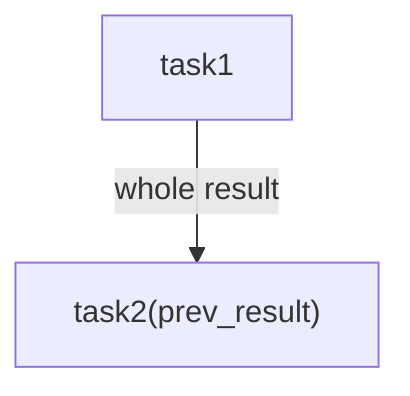
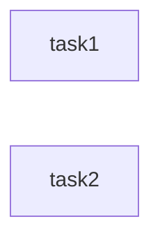
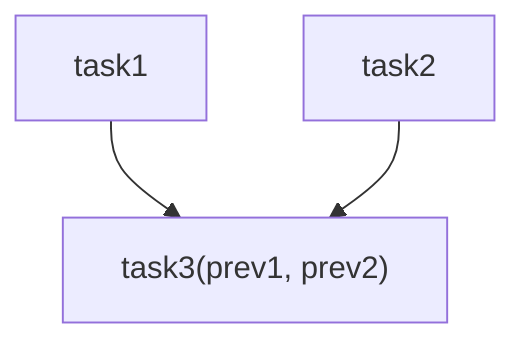
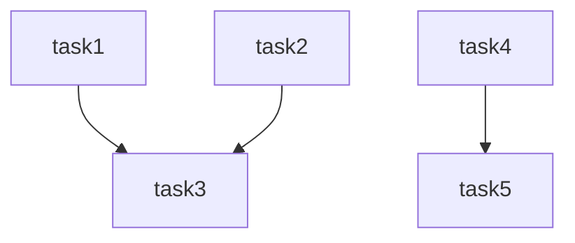
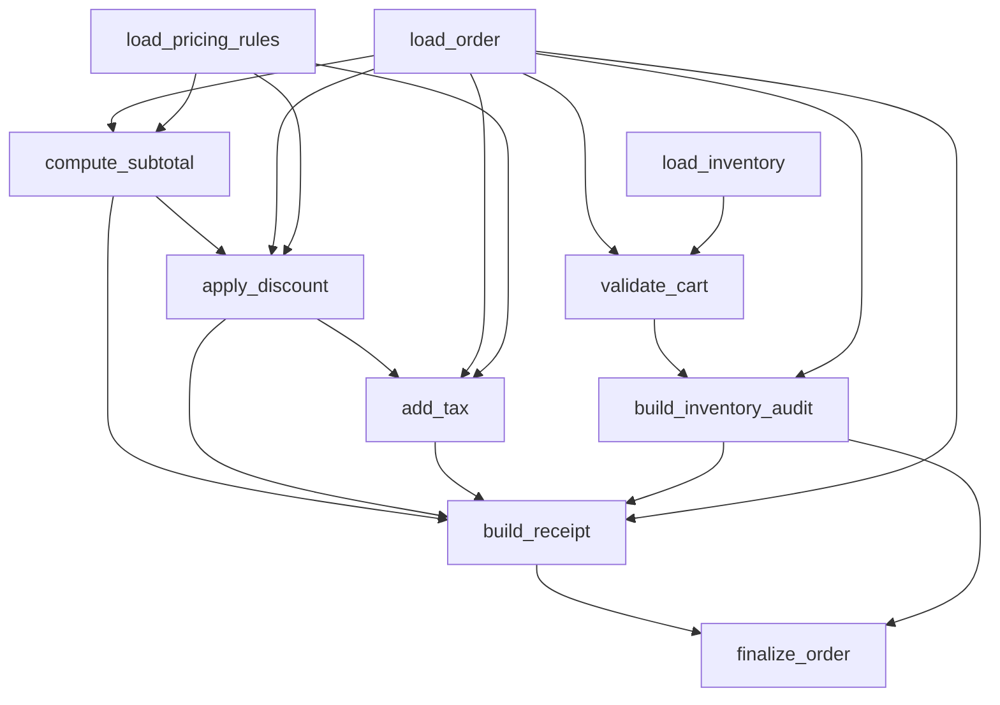
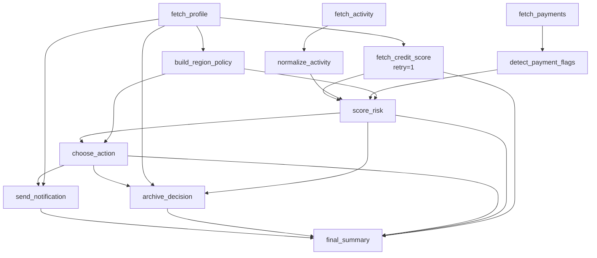

# Fast Start Example

`examples/fast_start.py` is a compact tour of common Astrum workflow shapes. It contains 6 examples that cover serial dependencies, parallel execution, fan-in, independent branches, field-level data transport, async tasks, and retries.

Read this page after the [Quickstart](../quickstart.md): the quickstart shows the smallest working workflow, while `fast_start.py` shows the DAG patterns you will see in real code.

## Run it

```bash
python examples/fast_start.py
```

All examples share this configuration:

```python
CONFIG = AstrumConfig(
    skip_type_check=True,
    silence=True,
    silence_warnings=True,
    visualize=True,
)
```

`visualize=True` prints Rich-powered scheduler visualization, so install:

```bash
pip install "astrum[viz]"
```

## Overview

| Example | DAG shape | Focus |
| --- | --- | --- |
| `example_1` | `task1 -> task2` | Serial dependency and whole-result passing. |
| `example_2` | `task1` and `task2` in parallel | Independent tasks run in the same stage. |
| `example_3` | Two entries converge into one task | Fan-in and multi-argument injection. |
| `example_4` | Two independent branch groups | Mixed serial/parallel execution and multiple outputs. |
| `example_5` | Order checkout DAG | Field-level `Ref/F` data transport. |
| `example_6` | Async risk workflow | Async tasks, retry, notification, and archive branches. |

## Example 1: serial dependency



`task2` receives the whole return value of `task1` through `Ref[str, F("task1")]`:

```python
@task("task2", namespace="example_1")
def task2(prev_result: Ref[str, F("task1")]) -> str:
    return "task2" + prev_result
```

The key point: a data dependency also completes the execution dependency, so `task2` waits for `task1`.

## Example 2: pure parallelism



`task1` and `task2` have no dependency and no data transport relation, so they can start in the same stage. This is the baseline rule: no dependency means no waiting.

## Example 3: triangle fan-in



`task3` receives values from two upstream tasks:

```python
def task3(
    prev1: Ref[str, F("task1")],
    prev2: Ref[str, F("task2")],
) -> str:
    return "task3" + prev1 + prev2
```

This is the most common convergence pattern: multiple entry tasks run in parallel, and the downstream task waits until all inputs are ready.

## Example 4: independent compound branches



The left branch group `task1/task2/task3` and the right branch group `task4/task5` are independent. Astrum advances each branch according to its own dependencies without blocking unrelated work.

## Example 5: order checkout data flow



This example demonstrates field-level data transport. For example, `apply_discount` reads fields from different upstream tasks:

```python
def apply_discount(
    subtotal_cents: Ref[int, F("compute_subtotal", "subtotal_cents")],
    coupon: Ref[str, F("load_order", "coupon")],
    discounts: Ref[dict, F("load_pricing_rules", "discounts")],
) -> dict:
    ...
```

`build_receipt` converges order fields, money fields, tax fields, and inventory audit results. `finalize_order` then reads the whole receipt object plus the audit id.

## Example 6: async tasks and retry



`fetch_credit_score` intentionally fails once and succeeds on its second attempt through `retry=1`:

```python
@task("fetch_credit_score", namespace="example_6", retry=1)
async def fetch_credit_score(
    customer_id: Ref[str, F("fetch_profile", "customer_id")],
) -> dict:
    ...
```

This example combines async entry tasks, retry, multi-channel risk scoring, action selection, and two downstream side branches for notification and archive.

## Reading path

When reading this file:

1. Start with each `@task(..., namespace="example_n")` to identify the tasks.
2. Inspect `Ref[..., F(...)]` parameters to connect data sources.
3. Read `build_scheduler(namespace="example_n", config=CONFIG)` and the assertions to confirm the final result.

