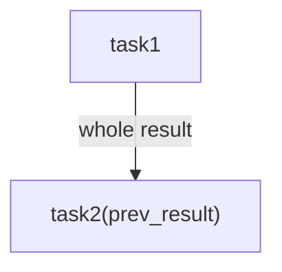
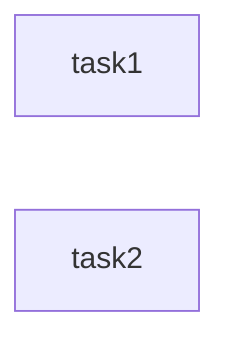
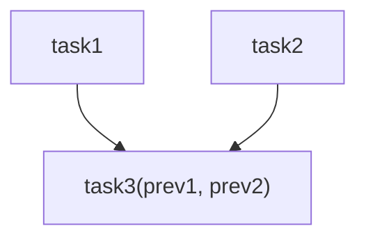
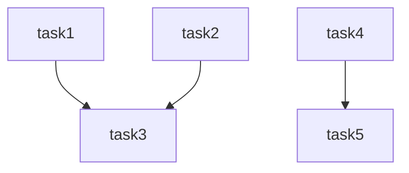
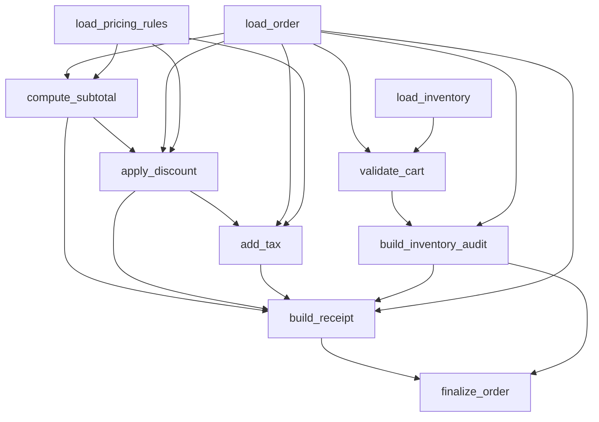
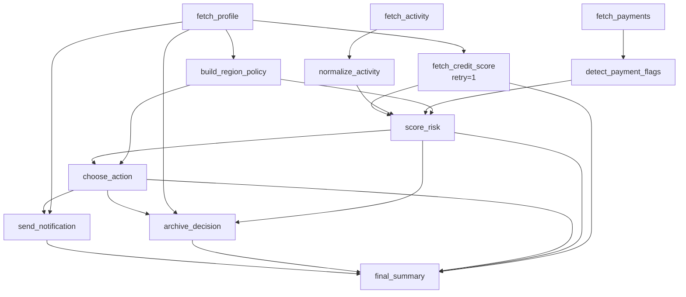

# Fast Start 示例

`examples/fast_start.py` 是一组由浅入深的 Astrum 工作流速览。它用 6 个小例子展示串行依赖、并行执行、fan-in、互不干扰的并行分支、字段级数据传输，以及异步任务重试。

这份示例适合在读完 [快速开始](../quickstart.md) 后继续阅读：快速开始展示最小用法，而 `fast_start.py` 展示常见 DAG 形状。

## 运行方式

```bash
python examples/fast_start.py
```

示例统一使用：

```python
CONFIG = AstrumConfig(
    skip_type_check=True,
    silence=True,
    silence_warnings=True,
    visualize=True,
)
```

`visualize=True` 会在构建 scheduler 时输出 Rich 可视化结果，需要安装：

```bash
pip install "astrum[viz]"
```

## 例子总览

| 例子 | DAG 形状 | 重点 |
| --- | --- | --- |
| `example_1` | `task1 -> task2` | 串行依赖和整值传递。 |
| `example_2` | `task1` 与 `task2` 并行 | 无依赖任务会同阶段执行。 |
| `example_3` | 两个入口汇入一个任务 | fan-in 和多参数注入。 |
| `example_4` | 左右两组分支互不干扰 | 混合串行、并行和多终点结果。 |
| `example_5` | 订单结算 DAG | 字段级 `Ref/F` 数据传输。 |
| `example_6` | 异步风控 DAG | async task、retry、通知和归档分支。 |

## 例子 1：串行依赖



`task2` 使用 `Ref[str, F("task1")]` 接收 `task1` 的整个返回值：

```python
@task("task2", namespace="example_1")
def task2(prev_result: Ref[str, F("task1")]) -> str:
    return "task2" + prev_result
```

这个例子强调：数据依赖会自动补全执行依赖，因此 `task2` 会等待 `task1`。

## 例子 2：纯并行



`task1` 和 `task2` 没有任何依赖，也没有数据传输关系，所以它们可以在同一个阶段启动。这个例子适合理解 Astrum 的并行基线：没有依赖，就不需要等待。

## 例子 3：三角形 fan-in



`task3` 同时接收来自两个上游任务的值：

```python
def task3(
    prev1: Ref[str, F("task1")],
    prev2: Ref[str, F("task2")],
) -> str:
    return "task3" + prev1 + prev2
```

这是最常见的汇聚形态：多个入口任务并行执行，最后一个任务等待所有输入就绪。

## 例子 4：互不干扰的复合分支



左侧 `task1/task2/task3` 和右侧 `task4/task5` 是两组独立分支。Astrum 会分别推进两边的依赖，而不会让互不相关的分支相互阻塞。

## 例子 5：订单结算数据流



这个例子展示字段级数据传输。比如 `apply_discount` 从不同任务读取不同字段：

```python
def apply_discount(
    subtotal_cents: Ref[int, F("compute_subtotal", "subtotal_cents")],
    coupon: Ref[str, F("load_order", "coupon")],
    discounts: Ref[dict, F("load_pricing_rules", "discounts")],
) -> dict:
    ...
```

最终 `build_receipt` 汇聚订单字段、金额字段、税费字段和库存审计结果，`finalize_order` 再读取整个 receipt 对象与审计 ID。

## 例子 6：异步任务与重试



`fetch_credit_score` 第一次会抛出临时错误，并通过 `retry=1` 在第二次尝试成功：

```python
@task("fetch_credit_score", namespace="example_6", retry=1)
async def fetch_credit_score(
    customer_id: Ref[str, F("fetch_profile", "customer_id")],
) -> dict:
    ...
```

这个例子把几个能力放在一起：异步入口并发、失败重试、多路评分汇聚、动作选择，以及通知/归档两个下游分支。

## 阅读建议

阅读这个文件时，可以按下面顺序理解每个例子：

1. 先看 `@task(..., namespace="example_n")`，确认有哪些任务。
2. 再看函数参数里的 `Ref[..., F(...)]`，确认数据来自哪里。
3. 最后看 `build_scheduler(namespace="example_n", config=CONFIG)` 和断言，确认最终结果。

