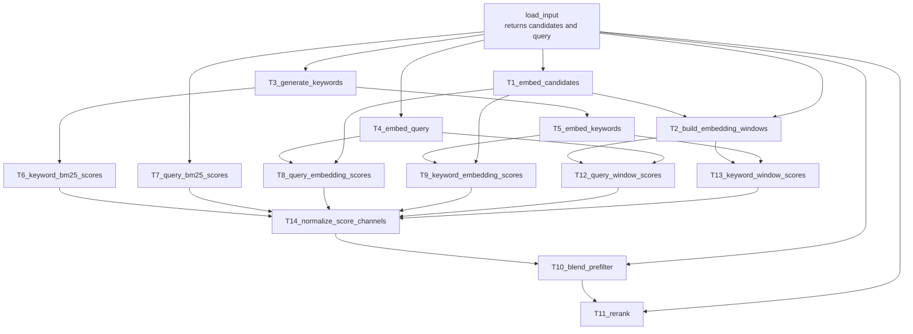
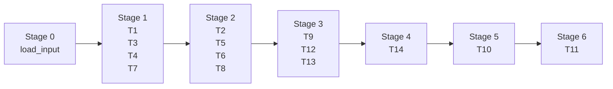

# Stateless Text Retriever Example

This page explains `examples/stateless_text_retriever.py`, a larger workflow that models a retrieval pipeline. It is not intended to be a production retriever; its purpose is to demonstrate fan-out, fan-in, internal concurrency, external API calls, score blending, and reranking in a Astrum DAG.

## Runtime dependencies

The example keeps its optional dependencies out of Astrum's core package dependencies. Install them before running the script:

```bash
pip install python-dotenv litellm rich numpy scipy
```

A minimal `.env` can look like this:

```env
RETRIEVER_PROVIDER=openai
RETRIEVER_API_KEY_ENV=OPENAI_API_KEY
RETRIEVER_API_KEY=sk-...
RETRIEVER_COMPLETION_MODEL=openai/gpt-5-mini
RETRIEVER_EMBEDDING_MODEL=openai/text-embedding-3-small
RETRIEVER_RERANK_MODEL=cohere/rerank-v3.5
RETRIEVER_EMBED_MAX_CONCURRENCY=8
RETRIEVER_PREFILTER_TOP_K=8
RETRIEVER_RERANK_TOP_K=5
```

To inspect the Astrum plan without making API calls:

```bash
python examples/stateless_text_retriever.py --plan-only
```

## DAG overview



The workflow has three major patterns:

- Input fan-out: `load_input` distributes `candidates` and `query` to multiple branches.
- Scoring branches: BM25, embedding cosine, and window cosine signals are computed independently.
- Result convergence: `T14` normalizes all channels, `T10` blends them into a prefilter set, and `T11` reranks the selected candidates.

## Execution stages



The first meaningful parallel batch is `T1`, `T3`, `T4`, and `T7`: candidate embedding, keyword generation, query embedding, and query BM25 can start as soon as `load_input` finishes.

## Score channels

| Channel | Producing task | Purpose |
| --- | --- | --- |
| `keyword_bm25` | `T6_keyword_bm25_scores` | Lexical signal from generated keywords. |
| `query_bm25` | `T7_query_bm25_scores` | Exact lexical signal from the original query. |
| `query_embedding` | `T8_query_embedding_scores` | Semantic similarity between query and candidates. |
| `keyword_embedding` | `T9_keyword_embedding_scores` | Semantic similarity between generated keywords and candidates. |
| `query_chunk` | `T12_query_window_scores` | Query-to-window semantic signal. |
| `keyword_chunk` | `T13_keyword_window_scores` | Keyword-to-window semantic signal. |

`T14` normalizes these channels, and `T10` applies environment-configured weights, thresholds, and top-k filtering.

## How to read this example

The best reading path is:

1. Start in `build_retriever_scheduler()` and list each `@workflow.task(...)`.
2. Inspect each `Ref[..., F("task", "field")]` annotation to connect data sources.
3. Run `--plan-only` to confirm which tasks run in parallel and where fan-in happens.

