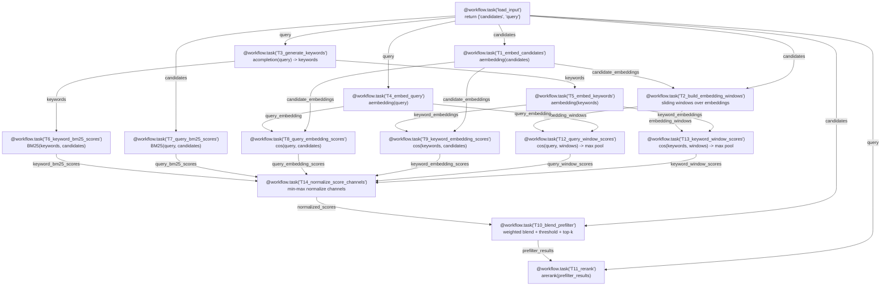
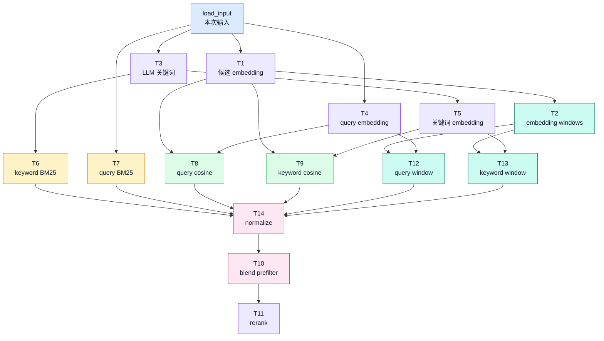
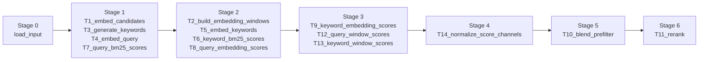
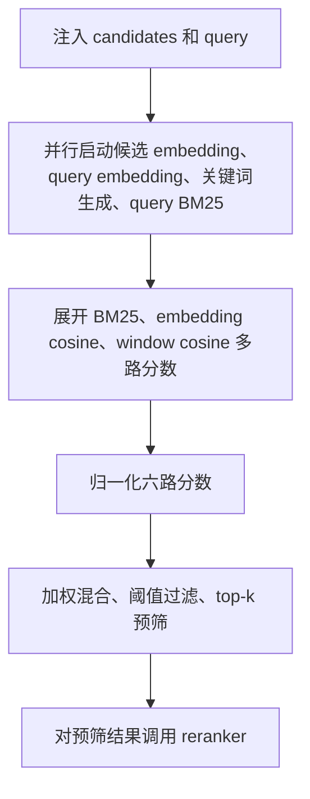

# Stateless Text Retriever 示例图解

本文用 Mermaid 图解释 `examples/stateless_text_retriever.py` 中的无状态文本召回器工作流。这个示例把“输入注入、候选 embedding、query 扩展、BM25、向量相似度、滑动窗口增强、分数融合、rerank”拆成一组 Astrum task，用一个真实检索链路展示复杂异步 DAG 的调度能力。

这个示例不验证召回准确率，也不把它包装成生产级检索器。它的重点是展示 Astrum 如何承载多路并发、fan-out、fan-in、内部并发和多层依赖。任务之间的数据流主要通过 `Ref[...]` 和 `F(...)` 注解自动生成，而不是手写 `TaskData` / `DataItem`。

## 配置与运行

示例依赖不写入项目主依赖。运行前安装：

```bash
pip install python-dotenv litellm rich numpy scipy
```

脚本启动时会先执行 `load_dotenv()`，再从环境变量读取所有现实参数。一个最小 `.env` 示例：

```env
RETRIEVER_PROVIDER=openai
RETRIEVER_API_KEY_ENV=OPENAI_API_KEY
RETRIEVER_API_KEY=sk-...
RETRIEVER_COMPLETION_MODEL=openai/gpt-5-mini
RETRIEVER_EMBEDDING_MODEL=openai/text-embedding-3-small
RETRIEVER_RERANK_MODEL=cohere/rerank-v3.5
RETRIEVER_EMBED_MAX_CONCURRENCY=8
RETRIEVER_PREFILTER_TOP_K=8
RETRIEVER_RERANK_TOP_K=5
```

如果只想看 Astrum 的执行计划，不发出任何 API 请求，可以运行：

```bash
python examples/stateless_text_retriever.py --plan-only
```

正常运行默认样例：

```bash
python examples/stateless_text_retriever.py
```

## DAG 总览



这张图里有三类关系：

- 输入扩散：`load_input` 把本次调用的 `candidates` 和 `query` 分发给多个独立分支。
- 分数分支：BM25、embedding cosine、window cosine 各自独立计算，最后汇入 `T14`。
- 结果收敛：`T10` 做预筛，`T11` 只对预筛范围调用 reranker。

## 彩色分类版

下面这张图按 DAG 语义给节点分类：输入、API 调用、词法分数、向量分数、窗口增强、融合和最终 rerank。



## 执行阶段

`--plan-only` 会打印 Astrum 真实规划出来的执行阶段。概念上可以理解为：



第一批真正有业务意义的任务是 `T1`、`T3`、`T4`、`T7`：它们都只依赖 `load_input`，因此可以并行启动。随后，关键词分支、embedding 分支、BM25 分支和窗口分支各自推进，直到 `T14` 把所有分数通道收齐。

## 逐任务说明

### 1. `load_input`

```python
@workflow.task("load_input")
async def load_input() -> dict[str, Any]:
    return {"candidates": candidates, "query": query}
```

`load_input` 是整个 DAG 的入口。它把 `retrieve(candidates, query)` 这次调用的输入注入到 Astrum 数据流中。因为 `SchedulerRegistry` 在每次调用里临时创建，所以这个示例不会把候选项或 embedding 缓存在全局状态里。

输出去向：

- `candidates` -> `T1_embed_candidates.candidate_texts`
- `candidates` -> `T2_build_embedding_windows.candidate_texts`
- `candidates` -> `T7_query_bm25_scores.candidate_texts`
- `candidates` -> `T10_blend_prefilter.candidate_texts`
- `query` -> `T3_generate_keywords.query_text`
- `query` -> `T4_embed_query.query_text`
- `query` -> `T7_query_bm25_scores.query_text`
- `query` -> `T11_rerank.query_text`

### 2. `T1_embed_candidates`

```python
@workflow.task("T1_embed_candidates")
async def embed_candidates(
    candidate_texts: Ref[list, F("load_input", "candidates")],
) -> dict[str, Any]:
    vectors = await embed_many(candidate_texts, settings)
    return {"candidate_embeddings": vectors}
```

`T1` 为每个候选文本调用 LiteLLM 的 `aembedding`。它内部还有一层 `asyncio.Semaphore(settings.embed_max_concurrency)`，用于控制单个 task 内部的 embedding 请求并发。

输出去向：

- `candidate_embeddings` -> `T2_build_embedding_windows.candidate_embeddings`
- `candidate_embeddings` -> `T8_query_embedding_scores.candidate_embeddings`
- `candidate_embeddings` -> `T9_keyword_embedding_scores.candidate_embeddings`

### 3. `T2_build_embedding_windows`

```python
@workflow.task("T2_build_embedding_windows")
async def build_windows(
    candidate_texts: Ref[list, F("load_input", "candidates")],
    candidate_embeddings: Ref[list, F("T1_embed_candidates", "candidate_embeddings")],
) -> dict[str, Any]:
    windows = build_embedding_windows(candidate_texts, candidate_embeddings, ...)
    return {"embedding_windows": windows}
```

`T2` 把候选项按滑动窗口切块，并对窗口内的候选 embedding 求 centroid。它模拟现实检索中“相邻片段上下文可能有用”的增强思路。

输出去向：

- `embedding_windows` -> `T12_query_window_scores.embedding_windows`
- `embedding_windows` -> `T13_keyword_window_scores.embedding_windows`

### 4. `T3_generate_keywords`

```python
@workflow.task("T3_generate_keywords")
async def generate_keywords(
    query_text: Ref[str, F("load_input", "query")],
) -> dict[str, Any]:
    keywords = await call_keyword_llm(query_text, settings)
    return {"keywords": keywords}
```

`T3` 调用 LiteLLM 的 `acompletion`，要求模型为 query 生成 JSON 字符串列表。这个分支展示了“query expansion”一类现实召回器常见操作。

输出去向：

- `keywords` -> `T5_embed_keywords.keywords`
- `keywords` -> `T6_keyword_bm25_scores.keywords`

### 5. `T4_embed_query`

```python
@workflow.task("T4_embed_query")
async def embed_query(
    query_text: Ref[str, F("load_input", "query")],
) -> dict[str, Any]:
    vector = await embed_text(query_text, settings)
    return {"query_embedding": vector}
```

`T4` 为 query 本体生成 embedding。它不需要等待候选项 embedding，也不需要等待关键词生成，因此可以和 `T1`、`T3`、`T7` 并行运行。

输出去向：

- `query_embedding` -> `T8_query_embedding_scores.query_embedding`
- `query_embedding` -> `T12_query_window_scores.query_embedding`

### 6. `T5_embed_keywords`

```python
@workflow.task("T5_embed_keywords")
async def embed_keywords(
    keywords: Ref[list, F("T3_generate_keywords", "keywords")],
) -> dict[str, Any]:
    vectors = await embed_many(keywords, settings) if keywords else []
    return {"keyword_embeddings": vectors}
```

`T5` 等待 `T3` 的关键词列表，然后为每个关键词生成 embedding。它和 `T6` 都依赖关键词，但二者互不依赖，因此可以并行。

输出去向：

- `keyword_embeddings` -> `T9_keyword_embedding_scores.keyword_embeddings`
- `keyword_embeddings` -> `T13_keyword_window_scores.keyword_embeddings`

### 7. `T6_keyword_bm25_scores`

```python
@workflow.task("T6_keyword_bm25_scores")
async def keyword_bm25(
    candidate_texts: Ref[list, F("load_input", "candidates")],
    keywords: Ref[list, F("T3_generate_keywords", "keywords")],
) -> dict[str, Any]:
    return {"keyword_bm25_scores": bm25_scores(candidate_texts, query_terms)}
```

`T6` 把联想关键词展开成词项，再和候选项计算 BM25 分数。BM25 在示例里是本地轻量实现，没有引入额外 `rank_bm25` 依赖。

输出去向：

- `keyword_bm25_scores` -> `T14_normalize_score_channels.keyword_bm25_scores`

### 8. `T7_query_bm25_scores`

```python
@workflow.task("T7_query_bm25_scores")
async def query_bm25(
    candidate_texts: Ref[list, F("load_input", "candidates")],
    query_text: Ref[str, F("load_input", "query")],
) -> dict[str, Any]:
    return {"query_bm25_scores": bm25_scores(candidate_texts, tokenize(query_text))}
```

`T7` 使用 query 原文和候选项计算 BM25。它展示了词法召回分支可以和 LLM/embedding API 分支同时运行。

输出去向：

- `query_bm25_scores` -> `T14_normalize_score_channels.query_bm25_scores`

### 9. `T8_query_embedding_scores`

```python
@workflow.task("T8_query_embedding_scores")
async def query_embedding_scores(
    query_embedding: Ref[list, F("T4_embed_query", "query_embedding")],
    candidate_embeddings: Ref[list, F("T1_embed_candidates", "candidate_embeddings")],
) -> dict[str, Any]:
    scores = cosine_scores([query_embedding], candidate_embeddings)
    return {"query_embedding_scores": scores}
```

`T8` 等待 query embedding 和候选 embedding 两路输入，用 `numpy` + `scipy.spatial.distance.cdist(..., metric="cosine")` 计算余弦相似度。

输出去向：

- `query_embedding_scores` -> `T14_normalize_score_channels.query_embedding_scores_value`

### 10. `T9_keyword_embedding_scores`

```python
@workflow.task("T9_keyword_embedding_scores")
async def keyword_embedding_scores(
    keyword_embeddings: Ref[list, F("T5_embed_keywords", "keyword_embeddings")],
    candidate_embeddings: Ref[list, F("T1_embed_candidates", "candidate_embeddings")],
) -> dict[str, Any]:
    scores = cosine_scores(keyword_embeddings, candidate_embeddings)
    return {"keyword_embedding_scores": scores}
```

`T9` 使用多个关键词 embedding 和候选 embedding 计算相似度。`cosine_scores` 会对多条 query 向量取最大相似度，相当于把多个联想词的语义命中汇总回每个候选项。

输出去向：

- `keyword_embedding_scores` -> `T14_normalize_score_channels.keyword_embedding_scores_value`

### 11. `T12_query_window_scores`

```python
@workflow.task("T12_query_window_scores")
async def query_window_scores(
    embedding_windows: Ref[list, F("T2_build_embedding_windows", "embedding_windows")],
    query_embedding: Ref[list, F("T4_embed_query", "query_embedding")],
    candidate_texts: Ref[list, F("load_input", "candidates")],
) -> dict[str, Any]:
    scores = pool_window_scores(embedding_windows, window_scores, len(candidate_texts))
    return {"query_window_scores": scores}
```

`T12` 比较 query embedding 和每个窗口 centroid 的相似度，然后把窗口分数 max-pool 回窗口覆盖的候选项。这个分支让 `T2` 的切块结果真正参与最终融合。

输出去向：

- `query_window_scores` -> `T14_normalize_score_channels.query_window_scores_value`

### 12. `T13_keyword_window_scores`

```python
@workflow.task("T13_keyword_window_scores")
async def keyword_window_scores(
    embedding_windows: Ref[list, F("T2_build_embedding_windows", "embedding_windows")],
    keyword_embeddings: Ref[list, F("T5_embed_keywords", "keyword_embeddings")],
    candidate_texts: Ref[list, F("load_input", "candidates")],
) -> dict[str, Any]:
    scores = pool_window_scores(embedding_windows, window_scores, len(candidate_texts))
    return {"keyword_window_scores": scores}
```

`T13` 和 `T12` 类似，但使用关键词 embedding 与窗口 centroid 比较。它展示了同一个上游窗口结果可以被多个下游分支复用。

输出去向：

- `keyword_window_scores` -> `T14_normalize_score_channels.keyword_window_scores_value`

### 13. `T14_normalize_score_channels`

```python
@workflow.task("T14_normalize_score_channels")
async def normalize_score_channels(...) -> dict[str, Any]:
    normalized = {name: min_max_normalize(scores) for name, scores in raw_channels.items()}
    return {"normalized_scores": normalized, "score_channel_summary": summary}
```

`T14` 是一个典型的多源汇聚节点。它必须等待六路分数全部完成，然后做 min-max 归一化，并生成 Rich 表格可打印的 score channel 摘要。

输入来源：

- `T6.keyword_bm25_scores`
- `T7.query_bm25_scores`
- `T8.query_embedding_scores`
- `T9.keyword_embedding_scores`
- `T12.query_window_scores`
- `T13.keyword_window_scores`

### 14. `T10_blend_prefilter`

```python
@workflow.task("T10_blend_prefilter")
async def blend_prefilter(
    candidate_texts: Ref[list, F("load_input", "candidates")],
    normalized_scores: Ref[dict, F("T14_normalize_score_channels", "normalized_scores")],
) -> dict[str, Any]:
    prefilter_results = blend_results(candidate_texts, normalized_scores, settings)
    return {"prefilter_results": prefilter_results}
```

`T10` 把归一化后的六路分数按环境变量里的权重混合，然后排序、阈值过滤、top-k 截断。它代表“便宜召回阶段”的最终输出。

输出去向：

- `prefilter_results` -> `T11_rerank.prefilter_results`

### 15. `T11_rerank`

```python
@workflow.task("T11_rerank")
async def rerank_results(
    query_text: Ref[str, F("load_input", "query")],
    prefilter_results: Ref[list, F("T10_blend_prefilter", "prefilter_results")],
) -> dict[str, Any]:
    final_results = await call_reranker(query_text, prefilter_results, settings)
    return {"final_results": final_results}
```

`T11` 只对 `T10` 预筛后的候选范围调用 LiteLLM 的 `arerank`。它解析 Cohere-style response，再按 rerank 分数排序、阈值过滤、top-k 截断，得到最终结果。

## 数据流矩阵

| 下游 task | 参数 | 数据来源 |
| --- | --- | --- |
| `T1_embed_candidates` | `candidate_texts` | `load_input.candidates` |
| `T2_build_embedding_windows` | `candidate_texts` | `load_input.candidates` |
| `T2_build_embedding_windows` | `candidate_embeddings` | `T1_embed_candidates.candidate_embeddings` |
| `T3_generate_keywords` | `query_text` | `load_input.query` |
| `T4_embed_query` | `query_text` | `load_input.query` |
| `T5_embed_keywords` | `keywords` | `T3_generate_keywords.keywords` |
| `T6_keyword_bm25_scores` | `candidate_texts` | `load_input.candidates` |
| `T6_keyword_bm25_scores` | `keywords` | `T3_generate_keywords.keywords` |
| `T7_query_bm25_scores` | `candidate_texts` | `load_input.candidates` |
| `T7_query_bm25_scores` | `query_text` | `load_input.query` |
| `T8_query_embedding_scores` | `query_embedding` | `T4_embed_query.query_embedding` |
| `T8_query_embedding_scores` | `candidate_embeddings` | `T1_embed_candidates.candidate_embeddings` |
| `T9_keyword_embedding_scores` | `keyword_embeddings` | `T5_embed_keywords.keyword_embeddings` |
| `T9_keyword_embedding_scores` | `candidate_embeddings` | `T1_embed_candidates.candidate_embeddings` |
| `T12_query_window_scores` | `embedding_windows` | `T2_build_embedding_windows.embedding_windows` |
| `T12_query_window_scores` | `query_embedding` | `T4_embed_query.query_embedding` |
| `T12_query_window_scores` | `candidate_texts` | `load_input.candidates` |
| `T13_keyword_window_scores` | `embedding_windows` | `T2_build_embedding_windows.embedding_windows` |
| `T13_keyword_window_scores` | `keyword_embeddings` | `T5_embed_keywords.keyword_embeddings` |
| `T13_keyword_window_scores` | `candidate_texts` | `load_input.candidates` |
| `T14_normalize_score_channels` | `keyword_bm25_scores` | `T6_keyword_bm25_scores.keyword_bm25_scores` |
| `T14_normalize_score_channels` | `query_bm25_scores` | `T7_query_bm25_scores.query_bm25_scores` |
| `T14_normalize_score_channels` | `query_embedding_scores_value` | `T8_query_embedding_scores.query_embedding_scores` |
| `T14_normalize_score_channels` | `keyword_embedding_scores_value` | `T9_keyword_embedding_scores.keyword_embedding_scores` |
| `T14_normalize_score_channels` | `query_window_scores_value` | `T12_query_window_scores.query_window_scores` |
| `T14_normalize_score_channels` | `keyword_window_scores_value` | `T13_keyword_window_scores.keyword_window_scores` |
| `T10_blend_prefilter` | `candidate_texts` | `load_input.candidates` |
| `T10_blend_prefilter` | `normalized_scores` | `T14_normalize_score_channels.normalized_scores` |
| `T11_rerank` | `query_text` | `load_input.query` |
| `T11_rerank` | `prefilter_results` | `T10_blend_prefilter.prefilter_results` |

## 分数通道

| 通道 | 生成任务 | 作用 |
| --- | --- | --- |
| `keyword_bm25` | `T6_keyword_bm25_scores` | 用联想关键词补充词法召回信号 |
| `query_bm25` | `T7_query_bm25_scores` | 保留 query 原文的精确词项匹配 |
| `query_embedding` | `T8_query_embedding_scores` | 捕获 query 与候选项的语义相似度 |
| `keyword_embedding` | `T9_keyword_embedding_scores` | 捕获联想关键词与候选项的语义相似度 |
| `query_chunk` | `T12_query_window_scores` | 让相邻候选组成的窗口参与 query 语义匹配 |
| `keyword_chunk` | `T13_keyword_window_scores` | 让相邻候选组成的窗口参与关键词语义匹配 |

`T14` 会把这些通道分别归一化，`T10` 再按宏定义权重混合。这个设计不是为了证明准确率，而是为了制造一个现实上说得通、调度上足够复杂的 DAG。

## 如何理解这段示例

`stateless_text_retriever.py` 的重点不是“写一个最短召回器”，而是“把一个真实召回器可能出现的多路计算拆成可调度的 DAG”。如果按源码从上往下读，很容易被 helper、Rich 输出和配置读取打散；更好的阅读顺序是：

1. 先看 `build_retriever_scheduler()` 里的每个 `@workflow.task(...)`。
2. 再看每个参数上的 `Ref[..., F("task", "field")]`，把数据来源连起来。
3. 最后看 `--plan-only` 输出，确认哪些 task 会并行，哪些 task 必须等待多路上游。

最终执行逻辑可以概括为：



阅读这类 Astrum 示例时，建议把“任务依赖”和“数据映射”分开看。任务依赖决定什么时候能运行，数据映射决定运行时参数从哪里来；这个示例正是通过大量并行分支和最后的多源汇聚，展示 Astrum 对复杂本地异步工作流的承载方式。
